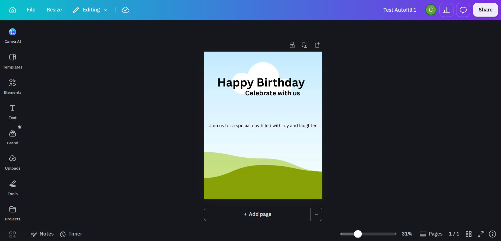

# MVP 1 Verification

Verification record for **MVP 1 — Canva Integration**. Branch: `milestone/mvp1-canva`.

## Requirements (Definition of Done)

From `ROADMAP.md` §MVP 1. The application can:

```text
Manually created Canva template
        ↓
Retrieve template
        ↓
Discover fields
        ↓
Submit Autofill data
        ↓
Generate Canva design
        ↓
Obtain exported asset
```

Acceptance criteria, mapped to milestones:

- 1.1 Canva developer application created and configured (scopes, redirect URL).
- 1.2 Application authenticates with the Canva account (OAuth 2.0 Authorization Code + PKCE).
- 1.3 Application retrieves brand templates from Canva.
- 1.4 Application discovers a template's Autofill fields and their types.
- 1.5 Application submits data and generates a design via Autofill.
- 1.6 Application programmatically exports the generated design and obtains the asset.

## Prerequisites

- Canva developer app (`cjcrsg-flow`) with an enabled auth client under
  Build → Outside Canva → Configuration, scopes `brandtemplate:content:read`,
  `brandtemplate:meta:read`, `design:content:read`, `design:content:write`,
  `design:meta:read`, `profile:read`, and redirect URL
  `http://127.0.0.1:3001/oauth/callback`.
- Repo-root `.env` with `CANVA_CLIENT_ID`, `CANVA_CLIENT_SECRET`, and
  `CANVA_REDIRECT_URI` set.
- Node.js 24, pnpm 12, and Docker (for the Compose stack).

## Test steps

### Step 0 — Install dependencies

From the repo root, once:

```sh
pnpm install
```

### Step 1 — Run the app

Choose **one** of the following.

#### Option A: local dev (two terminals)

```sh
# terminal 1 — backend API, http://127.0.0.1:3001
pnpm --filter backend dev

# terminal 2 — frontend UI, http://127.0.0.1:3000
pnpm --filter frontend dev
```

#### Option B: Docker (one command)

```sh
docker compose up --build
```

Either way, wait until:

- `curl http://127.0.0.1:3001/health` returns `{"status":"ok"}`
- `curl -o /dev/null -w "%{http_code}" http://127.0.0.1:3000` returns `200`

### Step 2 — Connect to Canva (OAuth)

1. Open **http://127.0.0.1:3000** in your browser.
2. Click **Connect to Canva**, then **Allow** on Canva's consent screen.
3. You are redirected back to the frontend with `?connected=1`.

### Step 3 — Verify authentication

```sh
curl http://127.0.0.1:3001/canva/status
# → {"configured":true,"authenticated":true}
```

### Step 4 — Exercise the Canva workflow (curl)

```sh
# 1.3 Retrieve templates — note a template id
curl http://127.0.0.1:3001/canva/templates

# 1.4 Discover fields
curl http://127.0.0.1:3001/canva/templates/EAHWepv4UXY/dataset

# 1.5 Autofill — create the job
curl -X POST http://127.0.0.1:3001/canva/autofill \
  -H 'Content-Type: application/json' \
  -d '{"brandTemplateId":"EAHWepv4UXY","title":"Test Autofill 1","data":{"heading":{"type":"text","text":"Happy Birthday"},"subheading":{"type":"text","text":"Celebrate with us"},"body":{"type":"text","text":"Join us for a special day."}}}'

# 1.5 Poll the job (replace {jobId}) until status == "success"; note the design id
curl http://127.0.0.1:3001/canva/autofill/{jobId}

# 1.6 Export — create the job (replace {designId})
curl -X POST http://127.0.0.1:3001/canva/exports \
  -H 'Content-Type: application/json' \
  -d '{"designId":"{designId}","format":"png"}'

# 1.6 Poll until "success", then download into storage (replace {jobId})
curl http://127.0.0.1:3001/canva/exports/{jobId}
curl -X POST http://127.0.0.1:3001/canva/exports/{jobId}/store \
  -H 'Content-Type: application/json' \
  -d '{"key":"exports/my-design.png"}'
```

The stored file appears under `backend/data/storage/`.

### Step 5 — Automated checks

```sh
pnpm typecheck
pnpm lint
pnpm test
pnpm build
docker compose config
```

## Test evidence

### Visual evidence

-  — the autofilled design `DAHWepMUQ0c` open in Canva.
-  — the exported PNG obtained via `StorageService` (1080×1350).

### Automated tests

```text
 RUN  v3.2.7 /home/eydamson/projects/cjcrsg-flow/backend
 ✓ src/modules/canva/token-store.test.ts (2 tests)
 ✓ src/modules/canva/oauth.test.ts (2 tests)
 ✓ src/storage/local-filesystem-storage.test.ts (2 tests)
 Test Files  3 passed (3)
      Tests  6 passed (6)
```

`pnpm typecheck`, `pnpm lint`, `pnpm --filter frontend build`, and
`pnpm --filter backend build` all pass. `docker compose config` validates.

### API evidence

`/canva/status` before OAuth:

```json
{"configured":true,"authenticated":false}
```

`/canva/status` after OAuth consent:

```json
{"configured":true,"authenticated":true}
```

`/canva/templates` (1.3):

```json
{"items":[{"id":"EAHWepv4UXY","title":"test-template-1"},{"id":"EAHQ6R8Qfec","title":"Daniel Faith Tuyor"}]}
```

`/canva/templates/EAHWepv4UXY/dataset` (1.4):

```json
{"dataset":{"body":{"type":"text"},"heading":{"type":"text"},"subheading":{"type":"text"},"background-image":{"type":"image"}}}
```

`POST /canva/autofill` (1.5) — job created:

```json
{"job":{"id":"1fc781a5-3487-40e6-bbe2-150caa19ea22","status":"in_progress"}}
```

`GET /canva/autofill/1fc781a5-3487-40e6-bbe2-150caa19ea22` (1.5) — succeeded, design generated:

```json
{
  "job": {
    "id": "1fc781a5-3487-40e6-bbe2-150caa19ea22",
    "status": "success",
    "result": {
      "type": "create_design",
      "design": {
        "id": "DAHWepMUQ0c",
        "title": "Test Autofill 1",
        "url": "https://www.canva.com/design/DAHWepMUQ0c/edit",
        "urls": {
          "edit_url": "https://www.canva.com/api/design/…/edit",
          "view_url": "https://www.canva.com/api/design/…/view"
        },
        "thumbnail": { "width": 320, "height": 400, "url": "https://export-download.canva.com/…" },
        "created_at": 1790592980,
        "updated_at": 1790592980,
        "page_count": 1
      }
    }
  }
}
```

`POST /canva/exports` (1.6) — export job created:

```json
{"job":{"id":"a7273c06-614b-4dd3-a9ed-54289eb8e149","status":"in_progress"}}
```

`GET /canva/exports/a7273c06-614b-4dd3-a9ed-54289eb8e149` (1.6) — succeeded:

```json
{"job":{"id":"a7273c06-614b-4dd3-a9ed-54289eb8e149","status":"success","urls":["https://export-download.canva.com/MUQ0c/DAHWepMUQ0c/-1/0/0001-2093565222122945325.png?…"]}}
```

`POST /canva/exports/a7273c06-614b-4dd3-a9ed-54289eb8e149/store` (1.6) — asset obtained via `StorageService`:

```json
{"key":"exports/DAHWepMUQ0c.png","size":149610}
```

File on disk (local filesystem storage):

```text
backend/data/storage/exports/DAHWepMUQ0c.png:
  PNG image data, 1080 x 1350, 8-bit/color RGB, non-interlaced (149610 bytes)
```

## Known issues / deferred

Tracked in `docs/handoff.md`; acceptable for MVP 1:

- `/canva/*` endpoints have no app-level authentication (private-network assumption).
- Access token is in-memory only; re-authenticate after a backend restart.
- Pending-auth entries have no TTL; brand-template pagination dropped (first 100).
- `DatasetValue` supports text/image/video; chart/sheet are preview features not yet handled.
- Env loading is cwd-fragile; `DATABASE_URL` is required but unused in MVP 1.
- Stored exports have no read route yet (needed for Facebook media in MVP 4).
- Canva Pro Autofill runs under a limited development trial quota.
